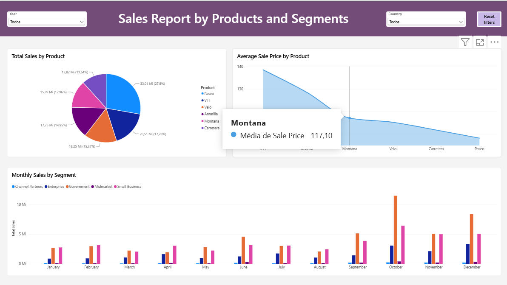
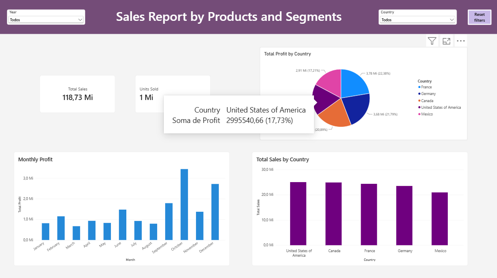
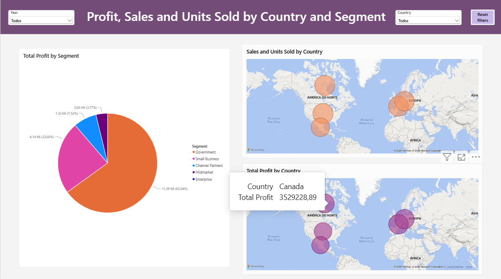

**Desafio 02 — Relatório de Vendas no Power BI**

Projeto desenvolvido durante o curso 'Primeiros Passos em Power BI', da DIO.

**Objetivo**

Construir um relatório interativo para análise de vendas, produtos, segmentos, países, lucro e unidades vendidas.

**Páginas do relatório**

* Products and Segments
* Sales Report by Country and Profit
* Geographic Analysis

**Funcionalidades**

* Filtros por ano e país
* Interações entre os gráficos
* Botões para limpar os filtros
* Mapas com bolhas proporcionais aos resultados
* Análises de vendas, lucro e unidades vendidas

**Ferramenta utilizada**

* Microsoft Power BI Desktop

**Download do projeto**

[Baixar o arquivo do Power BI](./Analisando%20dados%20com%20SQL%20E%20Power%20BI.pbix)

> Para visualizar todas as páginas, filtros e interações, baixe o arquivo e abra-o no Microsoft Power BI Desktop.

**Visualizações**

### Página 1 — Products and Segments

### Página 2 — Country and Profit

### Página 3 — Geographic Analysis

