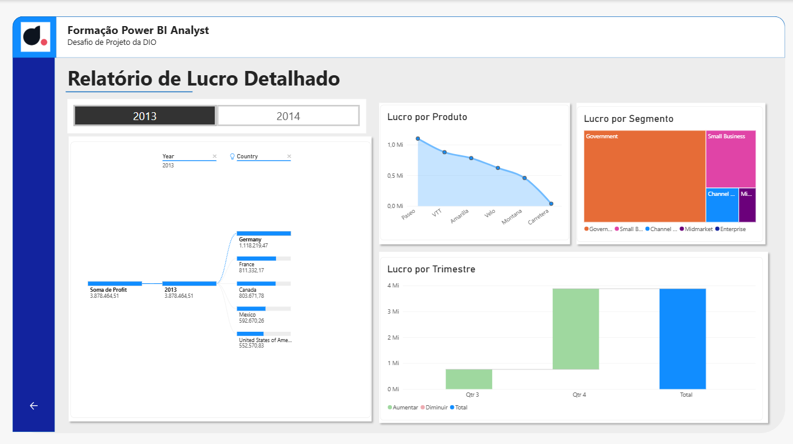

# Desafio 03 — Relatório de Vendas e Lucro no Power BI

Projeto desenvolvido durante o curso **Primeiros Passos em Power BI**, da DIO.

## Objetivo

Criar um relatório interativo e estruturado para análise de vendas e lucros, utilizando recursos de navegação, filtros e diferentes tipos de visualização.

## Recursos utilizados

* Power BI Desktop
* Segmentadores de dados
* Indicadores e botões
* Navegação entre páginas
* Gráficos de barras, linhas, rosca, mapa, Treemap e cascata
* Árvore de decomposição
* Análise por produto, segmento, país, ano e trimestre

## Páginas do relatório

### Relatório de Vendas

Apresenta indicadores gerais de vendas, evolução temporal e análises por produto, segmento e país.

### Relatório de Lucro Detalhado

Apresenta a análise de lucro por produto, segmento, país, ano e trimestre.

## Arquivo do projeto

O arquivo `.pbix` está disponível nesta pasta para download e visualização no Power BI Desktop.
[Baixar o relatório em Power BI](desafio-03-relatorio-vendas-lucro.pbix)
