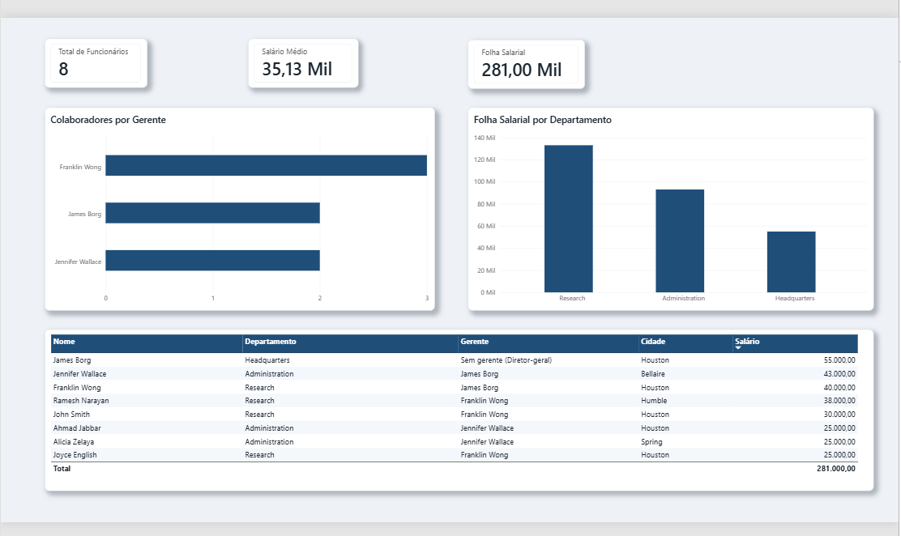

# Integrando Dados com MySQL no Azure e Transformando com Power BI

Desafio de projeto da **DIO**, trilha *Primeiros passos em Power BI*: **"Criando um Dashboard corporativo com integração com MySQL e Azure"**.



## Objetivo

- Configurar um banco de dados MySQL na nuvem (Azure)
- Popular o servidor com o script fornecido (base de teste **Company**)
- Integrar o MySQL do Azure com o Power BI
- Verificar problemas na base e realizar as transformações de dados indicadas no Power Query

## Tecnologias utilizadas

| Ferramenta | Uso |
|---|---|
| **Azure Database for MySQL – Servidor Flexível** | banco de dados na nuvem (MySQL 8.4) |
| **Azure Cloud Shell (Bash)** | criação e carga do banco via cliente `mysql` |
| **Power BI Desktop + Power Query** | conexão, limpeza e transformação dos dados |
| **MySQL Connector/NET** | driver exigido pelo Power BI para conectar ao MySQL |

## Estrutura do repositório

```
├── README.md
├── desafio-04-dashboard-mysql-azure-power-bi.pbix -> arquivo do Power BI com todas as transformações
├── tema-dashboard.json                  -> tema de cores personalizado do relatório
├── sql/
│   ├── 01_script_bd_company.sql         -> criação do schema azure_company e das tabelas
│   └── 02_insercao_de_dados.sql         -> inserção dos dados
└── imagens/
    └── dashboard.png                    -> print do dashboard final
```

---

## Etapa 1 – Criação do MySQL no Azure

Servidor criado pelo portal do Azure (conta de avaliação gratuita):

| Configuração | Valor |
|---|---|
| Tipo | Servidor flexível |
| Região | West US 2 |
| Tipo de carga de trabalho | Desenvolvimento/Teste |
| Computação + armazenamento | Intermitente (Burstable) – Standard_B1ms, 1 vCore, 2 GiB RAM, 20 GiB |
| Versão do MySQL | 8.4 |
| Alta disponibilidade | Desabilitada |

### Problema encontrado e solução

Ao tentar criar o servidor na região **Brazil South** (e em várias outras), o formulário do portal não exibia os campos **Versão do MySQL** e **Computação + armazenamento**, e a validação falhava com *"Falha na validação. As informações necessárias estão ausentes ou não são válidas"*.

Para investigar, usei o Azure CLI no Cloud Shell:

```bash
az mysql flexible-server list-skus --location eastus
```

O retorno era `InternalServerError`: a API não devolvia as opções de servidor para a assinatura naquela região. Testando várias regiões em sequência:

```bash
for r in eastus2 centralus westus2 westus3 canadacentral northeurope westeurope uksouth brazilsouth; do
  echo "== $r: $(az mysql flexible-server list-skus -l $r --query 'length(@)' -o tsv 2>&1 | tail -1)"
done
```

Apenas a **West US 2** respondeu corretamente, e o servidor foi criado nessa região.

> Também conferi se o provedor de recursos `Microsoft.DBforMySQL` estava registrado na assinatura (*Assinaturas > Provedores de recursos*). Ele já estava como **Registered**.

## Etapa 2 – Regras de firewall (Rede)

Em *Servidor > Configurações > Rede*:

- ✅ Acesso público habilitado
- ✅ **Permitir o acesso público de qualquer serviço do Azure** (necessário para o Cloud Shell)
- ✅ **Adicionar o endereço IP do cliente atual** (necessário para o Power BI Desktop)

## Etapa 3 – Criação e carga do banco pelo Cloud Shell

Os scripts foram baixados do [repositório da especialista](https://github.com/julianazanelatto/power_bi_analyst) e executados com o cliente `mysql`:

```bash
# criação do schema e das tabelas
mysql -h <servidor>.mysql.database.azure.com -u <usuario> -p --force < 01_script_bd_company.sql

# inserção dos dados
mysql -h <servidor>.mysql.database.azure.com -u <usuario> -p azure_company \
  -e "SET FOREIGN_KEY_CHECKS=0; source 02_insercao_de_dados.sql; SET FOREIGN_KEY_CHECKS=1;"
```

### Ajustes necessários nos scripts originais

1. **Nome do banco:** o script de inserção começava com `use company_constraints;`, mas o banco criado pelo primeiro script se chama `azure_company`. A linha foi trocada para `use azure_company;`.
2. **Chave estrangeira auto-referenciada:** a tabela `employee` tem uma FK para ela mesma (`Super_ssn -> Ssn`). Como os funcionários são inseridos antes dos seus gerentes, a inserção falhava. Por isso, a carga foi feita com `FOREIGN_KEY_CHECKS=0` e a verificação foi reativada ao final.
3. **`--force`:** o script de criação tem comandos como `drop table dependent;` e `alter table ... drop <constraint>` para objetos que ainda não existiam. O `--force` permite que o script continue após esses avisos.
4. As consultas de exemplo no final do script de inserção foram removidas, porque não fazem parte da carga.

Verificação final:

```sql
SELECT COUNT(*) AS funcionarios FROM employee;  -- 8
SHOW TABLES;  -- departament, dependent, dept_locations, employee, project, works_on
```

## Etapa 4 – Integração do Power BI com o MySQL no Azure

1. Instalação do **MySQL Connector/NET**, sem o qual o Power BI não conecta ao MySQL.
2. *Obter dados > Banco de dados MySQL*
   - Servidor: `<servidor>.mysql.database.azure.com`
   - Banco de dados: `azure_company`
   - Credenciais na aba **Banco de Dados** (usuário e senha do MySQL, e não credenciais do Windows)
3. Seleção das 6 tabelas e abertura do Power Query em **Transformar Dados**.

---

## Etapa 5 – Transformações no Power Query

### 5.1 Cabeçalhos e tipos de dados

- Foram removidas as colunas de **relacionamento** que o Power BI cria automaticamente a partir das chaves estrangeiras (conteúdo `Value` ou `Table`, nome iniciado por `azure_company.`). Elas não são dados.
- **Salary** convertido para **Número Decimal**, o tipo *double* do Power BI, conforme solicitado para valores monetários.
- **Hours** (`works_on`) mantido como **Número Decimal**. O tipo "Hora" do Power BI representa **horário do dia** (ex.: 14:30) e gera erro para valores como 32,5, que são **quantidade de horas**.
- Datas (`Bdate`, `Mgr_start_date`, `Dept_create_date`) conferidas como **Data**.

### 5.2 Valores nulos

Verificação feita com *Exibição > Qualidade da coluna*.

| Tabela | Coluna | Resultado | Decisão |
|---|---|---|---|
| employee | `Super_ssn` | 1 nulo (12%) | **mantido**, ver 5.3 |
| departament | `Mgr_ssn` | 0% vazio | nada a fazer |
| demais tabelas | — | 0% vazio | nada a fazer |

### 5.3 Colaboradores sem gerente

O único funcionário com `Super_ssn` nulo é **James Borg** (departamento *Headquarters*, maior salário: 55.000). Ele é o **diretor-geral**, o topo da hierarquia, e por isso não tem gerente. O nulo é **esperado** e o registro **não foi removido**: removê-lo apagaria o gerente de outros dois colaboradores.

### 5.4 Departamentos sem gerente

Os 3 departamentos (Research, Administration e Headquarters) têm `Mgr_ssn` preenchido. **Não houve lacunas para preencher.**

### 5.5 Horas dos projetos

Na `works_on`, as horas variam de 0 a 40. Há um registro com **0 horas**: o funcionário 888665555 (James Borg) no projeto 20 (*Reorganization*). O vínculo existe, mas sem horas lançadas, o que é coerente com o cargo de diretor.

### 5.6 Separação de colunas complexas (endereço)

A coluna `Address` segue o padrão `número-rua-cidade-estado` (ex.: `731-Fondren-Houston-TX`).

**Problema:** o endereço `975-Fire-Oak-Humble-TX` tem um hífen **dentro do nome da rua**. Na divisão por *"cada ocorrência do delimitador"*, esse registro ficava com 5 partes e a rua, a cidade e o estado ficavam deslocados.

**Solução:** dividir pelas pontas, em três etapas:

1. `-` **mais à esquerda** → `Numero` | resto
2. `-` **mais à direita** no resto → rua-cidade | `Estado`
3. `-` **mais à direita** de novo → `Rua` | `Cidade`

Por fim, *Substituir Valores* na coluna `Rua` (`-` → espaço) transformou `Fire-Oak` em **`Fire Oak`**.

### 5.7 Mescla employee + departament (nome do departamento)

- *Mesclar Consultas* a partir da **employee** (tabela base): `employee.Dno` → `departament.Dnumber`
- Tipo de junção: **Externa esquerda**, para manter todos os colaboradores mesmo que algum não tenha departamento correspondente
- Expandida apenas a coluna `Dname`, renomeada para **Departamento**, e sem as demais colunas da departament

### 5.8 Colaboradores e nome dos gerentes

Feito por **mescla no Power BI** (sem SQL), mesclando a `employee` com **ela mesma**:

- `employee.Super_ssn` → `employee.Ssn`
- Tipo de junção: **Externa esquerda**. Com uma junção interna, James Borg, que não tem gerente, **sumiria da tabela**. O resultado confirma: *"A seleção corresponde a 7 de 8 linhas"*.
- Expandida a coluna `Nome`, renomeada para **Gerente**
- Para o relatório, o valor nulo de James Borg na coluna `Gerente` foi substituído por **"Sem gerente (Diretor-geral)"**. Assim a célula vazia não parece erro de dados.

### 5.9 Nome + sobrenome

`Fname` e `Lname` mesclados em uma única coluna **Nome** (separador: espaço). A coluna `Minit` (inicial do meio) foi removida.

### 5.10 Departamento + localização

Nova consulta **`dept_local`** (*Mesclar Consultas como Novas*): `dept_locations.Dnumber` → `departament.Dnumber`, com `Dname` e `Dlocation` mesclados na coluna **Departamento_Local**:

| Dnumber | Departamento_Local |
|---|---|
| 1 | Headquarters-Houston |
| 4 | Administration-Stafford |
| 5 | Research-Bellaire |
| 5 | Research-Houston |
| 5 | Research-Sugarland |

Cada combinação departamento-local é **única**, o que vai servir de base para o modelo estrela em um módulo futuro.

#### Por que usar *Mesclar* e não *Acrescentar*?

- **Mesclar** junta tabelas **lado a lado** (adiciona **colunas**), relacionando as linhas por uma chave em comum, aqui o `Dnumber`.
- **Acrescentar** empilha tabelas **uma embaixo da outra** (adiciona **linhas**) e só faz sentido quando as tabelas têm a **mesma estrutura** de colunas.

A `departament` (Dname, Dnumber, Mgr_ssn...) e a `dept_locations` (Dnumber, Dlocation) têm estruturas diferentes, e o objetivo era **relacionar** cada local ao nome do seu departamento, e não somar registros. Por isso, apenas a mescla atende.

### 5.11 Colaboradores por gerente

Nova consulta **`colaboradores_por_gerente`** (duplicada da employee), com o nulo de `Gerente` filtrado e *Agrupar por* `Gerente` com a operação *Contar Linhas*:

| Gerente | Qtd_Colaboradores |
|---|---|
| Franklin Wong | 3 |
| James Borg | 2 |
| Jennifer Wallace | 2 |

Total: 7 colaboradores com gerente, mais James Borg, o que dá os 8 funcionários da base.

### 5.12 Remoção de colunas desnecessárias

- Colunas de relacionamento automático (`Value` / `Table`)
- `Minit`, substituída pela coluna **Nome**
- `Numero`, `Rua` e `Estado` (todos os registros são TX, então a coluna não diferencia nada)
- `Super_ssn`, substituída pela coluna **Gerente**

Mantidas as chaves `Ssn` e `Dno` para os relacionamentos do modelo.

### Chaves usadas nas mesclas

| Mescla | Chave estrangeira (FK) | Chave primária (PK) |
|---|---|---|
| Gerente | `employee.Super_ssn` | `employee.Ssn` |
| Departamento do colaborador | `employee.Dno` | `departament.Dnumber` |
| Departamento + local | `dept_locations.Dnumber` | `departament.Dnumber` |

---

## Etapa 6 – Dashboard

Relatório de uma página, com o tema personalizado `tema-dashboard.json` (*Exibição > Temas > Procurar temas*):

| Visual | Dados |
|---|---|
| Cartão – **Total de Funcionários** | contagem de `Nome` (employee) → 8 |
| Cartão – **Salário Médio** | média de `Salary` → 35,13 mil |
| Cartão – **Folha Salarial** | soma de `Salary` → 281 mil |
| Barras – **Colaboradores por Gerente** | `colaboradores_por_gerente` |
| Colunas – **Folha Salarial por Departamento** | soma de `Salary` por `Departamento` |
| Tabela – funcionários | Nome, Departamento, Gerente, Cidade, Salário |

Os visuais usam **filtro cruzado**: ao clicar num funcionário da tabela ou num departamento do gráfico, os demais visuais são filtrados automaticamente.

**Principais insights:**
- **Research** concentra a maior folha salarial (133 mil, 47% do total), com 4 dos 8 colaboradores.
- **Franklin Wong** é o gerente com a maior equipe (3 pessoas).
- **Headquarters** tem apenas o diretor-geral, James Borg, que também é o maior salário (55 mil).

---

## Aprendizados

- Contas de avaliação do Azure podem ter regiões indisponíveis para alguns serviços. O Azure CLI (`list-skus`) ajuda a descobrir o motivo quando o portal não mostra o erro.
- Scripts prontos nem sempre rodam de primeira: nome do banco, ordem de inserção e FKs auto-referenciadas precisam de atenção.
- No Power Query, cada ação vira uma **etapa aplicada**, e apagar a etapa desfaz a ação.
- A escolha do **tipo de junção** (externa esquerda x interna) muda o resultado. Aqui, ela evitou perder o diretor-geral.
- Dividir colunas "pelas pontas" (delimitador mais à esquerda/direita) evita erros quando o texto tem o delimitador no meio.

## Referências

- [Repositório da especialista – Juliana Mascarenhas](https://github.com/julianazanelatto/power_bi_analyst)
- [DIO](https://www.dio.me/)
